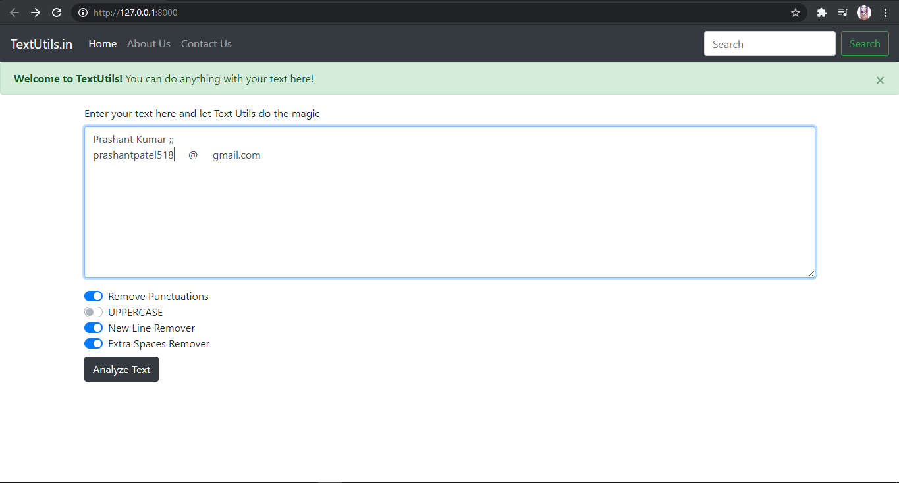
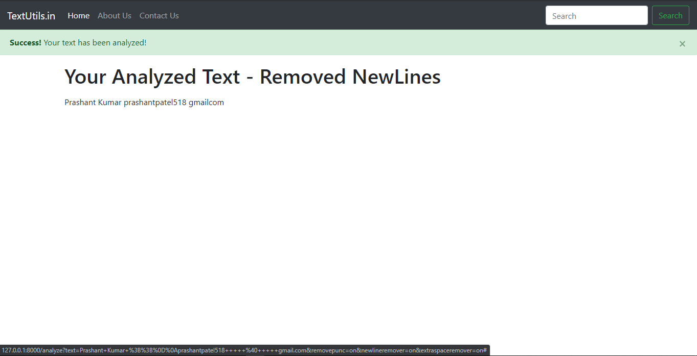
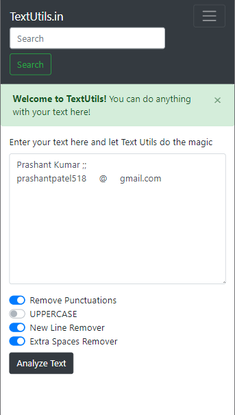

<h1>TextUtils.in</h1>
TextUtils is a Website made with Python and Django. It takes Text from the user and gives analysis as per the users selection.
<h4>This website helps you to Analyze your text by:- </h4> 
Removing punctuation.  
Making Whole Paragrapg in Uppercase.  
Removing New Lines.  
Removing Extra Space.  
<h3>Prerequisites</h3> 
Python  
Any IDE  
HTML&CSS  
Django  
<h3>HeroPage</h3>

<h3>Analyzed Page</h3>

<h3>Mobile View</h3>

